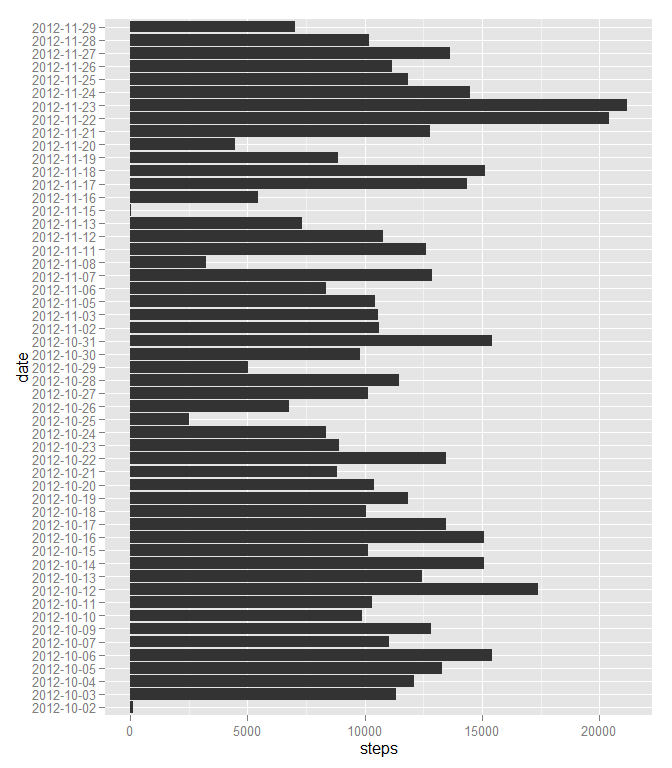
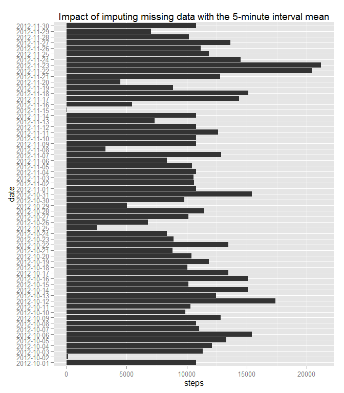
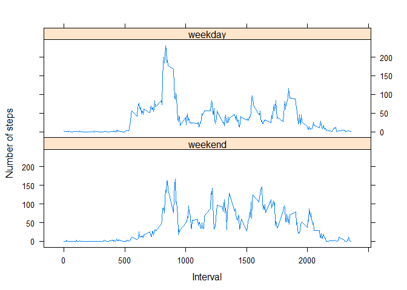

# Reproducible Research: Peer Assessment 1


## Loading and preprocessing the data

```r
# create a data frame from the activity data set
activity<-read.table("activity.csv", header=TRUE, sep=",", na.strings="NA")
```

## What is mean total number of steps taken per day?

```r
library(ggplot2)
```

```
## Warning: package 'ggplot2' was built under R version 3.1.2
```

```r
# calculate the total number of steps taken per day
daytotal<-aggregate(cbind(steps)~date,activity,sum)
# plot the histogram of the total number of steps taken each day
ggplot(data=daytotal, aes(x=date,y=steps)) + geom_bar(stat="identity") + coord_flip()
```

 

```r
# calculate and report the mean of the total number of steps taken per day
cat("Mean of the total number of steps taken per day:", mean(daytotal$steps))
```

```
## Mean of the total number of steps taken per day: 10766.19
```

```r
# calculate and report the median of the total number of steps taken per day
cat("Median of the total number of steps taken per day:", median(daytotal$steps))
```

```
## Median of the total number of steps taken per day: 10765
```


## What is the average daily activity pattern?

```r
# calculate the average number of steps taken by 5-minute intervals across all days
intavg<-aggregate(cbind(steps)~interval,activity,mean)
# make the time series plot on calculated averages
plot(intavg$interval,intavg$steps,type="l",xlab="Interval",ylab="Number of steps")
```

 

```r
cat("The 5-minute interval containing the maximum number of steps in the dataset is",intavg[which.max(intavg$steps),1])
```

```
## The 5-minute interval containing the maximum number of steps in the dataset is 835
```

## Imputing missing values

```r
# calculate and report the total number of missing values
cat("Total number of missing values in the dataset is",sum(is.na(activity)))
```

```
## Total number of missing values in the dataset is 2304
```

```r
# create a copy of the original data set
actcopy <- activity
# fill in the missing value with the mean for the corresponding 5-minute interval across all days
actcopy$steps <- ifelse(is.na(actcopy$steps),
                        intavg$steps[match(actcopy$interval, intavg$interval)], actcopy$steps)
# calculate the total number of steps taken per day with the copied data set
daytotal<-aggregate(cbind(steps)~date,actcopy,sum)
# plot the histogram of the total number of steps taken each day after filling in the missing values 
ggplot(data=daytotal, aes(x=date,y=steps)) + geom_bar(stat="identity") + coord_flip() + ggtitle("Impact of imputing missing data with the 5-minute interval mean")
```

 

```r
# calculate and report the mean of the total number of steps taken per day
cat("Mean of the total number of steps taken per day:", mean(daytotal$steps))
```

```
## Mean of the total number of steps taken per day: 10766.19
```

```r
# calculate and report the median of the total number of steps taken per day
cat("Median of the total number of steps taken per day:", median(daytotal$steps))
```

```
## Median of the total number of steps taken per day: 10766.19
```

## Are there differences in activity patterns between weekdays and weekends?

```r
library(plyr)
```

```
## Warning: package 'plyr' was built under R version 3.1.2
```

```r
# assign a new 'weekday' and 'weekend' factor
actcopy$day<-revalue(as.factor(weekdays(as.Date(actcopy$date))),c("Monday"="weekday","Tuesday"="weekday","Wednesday"="weekday","Thursday"="weekday","Friday"="weekday","Saturday"="weekend","Sunday"="weekend"))
# create a new data frame for average steps taken by 5-minute interval on weekend days
weintavg<-aggregate(cbind(steps)~interval,actcopy[(actcopy$day=="weekend"),],mean)
# add weekend factor
weintavg["day"]<-factor("weekend")
# create a new data frame for average steps taken by 5-minute interval on weekday days
wdintavg<-aggregate(cbind(steps)~interval,actcopy[(actcopy$day=="weekday"),],mean)
# add weekday factor
wdintavg["day"]<-factor("weekday")
# combine the 2 data frames
wintavg<-rbind(weintavg,wdintavg)
library(lattice)
# make a panel plot
xyplot(wintavg$steps ~ wintavg$interval | wintavg$day, layout=c(1,2), type="l", xlab="Interval", ylab="Number of steps")
```

 
